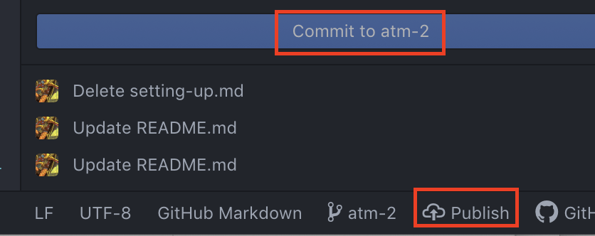

# Preparing your text

## Adding front matter

First, you'll want to open your text file in atom. You can do this from the command line:

`atom file.md`

Ed has several built in display features that you can activate by adding front matter to your file. Jekyll uses another markup language called YAML (Yet Another Markup Language). To begin with, you'll create a section for your front matter. You'll open the section by adding a line with three hyphens `---` and close it the same way.

```
---
layout: poem
title: Delayed till she had ceased to know
author: Emily Dickinson  
---
```

You can specify a variety of attributes of your document in this front matter. For this workshop, you'll want to include `title`, `author`, `layout`, and  (options here include narrative, poetry, and drama). You may also want to include `source`, `rights` (public domain), `editor.`

If it's useful, you can also add a table of contents for the sidebar menu.

```
toc:
- Chapter 1
- Chapter 2
- Chapter 3
```
Each item listed in the table of contents must correspond to a level 2 heading within the document, i.e.

```
## Chapter 1
```

For more information, see the [Ed documentation](https://minicomp.github.io/ed/documentation/#jekyll)

## Formatting your text using markdown

By now you'll be familiar with basic markdown syntax. If you'd like to do more complex formatting you can also use html and a version of markdown called kramdown--the [Ed documentation](https://minicomp.github.io/ed/documentation/#markdown-and-kramdown) has additional instructions on supported formatting for features such as footnotes, block quotes, and poetry.

You can see examples of this in the `_texts` directory: [Love Letters and Cards](/_texts/GenuineCopies-1770.md) and [Delayed till she had ceased to know](/_texts/delayed.md). Look at the formatting of the markdown files and compare them to the  

As you edit your file locally, you can preview it using the 'Markdown Preview' feature in Atom (Packages -> Markdown Preview)


Make sure you save your file often.   

----

# Working locally in GitHub

So far you've been contributing to GitHub using your browser, but you can also contribute by editing and saving files locally (on your computer) and then 'pushing' to the remote (cloud-based) repository. There are a few ways to do this:

1. using a GUI application such as [GitHub Desktop](https://desktop.github.com/)
2. using GitHub features available in some text editors (including Atom)
3. using git commands via the command line

In this lesson we will practice using the command line and Atom to push to git.

## Basic git workflow

Make sure you have a command prompt window open and that your current working directory is the Ed Minimal Editions repository. This is effective if you are the only person working on a repository or when (as is the case right now) each person is working on a separate document.

### 0. Save

Make sure you have saved changes to your file.

### 1. Stage or add

Before you can publish a file to GitHub, you have to tell Git about the file so it can track its changes. This is called "staging."

`git add newfile.md`

 If you'd like to add all recent changes at once, use:

`git add --all`

In atom, you can do this by opening the GitHub pane (Packages --> GitHub --> Toggle Git Tab)


A column should appear on the left side. In the top of the column, you'll see a list of all the files in this repo that have "Unstaged Changes." To allow git to track them, click on "Stage All".


Now you should see the same files listed under "Staged Changes".


### 2. Commit

Once Git has begun tracking your file changes, you **commit** them: you package them for publication and label them for your collaborators, including your future self. Think of it as temporarily "committing" to a draft or a batch of edits.

`git commit -m "message describing my changes"`

In Atom, write a short message in the box below your Staged Changes. Then click "Commit to master."


### 3. Push

Now you're ready to publish or 'push' to the remote repository and publish your changes to GitHub.

`git push origin master`

If you haven't yet contributed to GitHub from the command line, you will need to log in with your GitHub credentials.

In Atom, you'll see a list of your commits below the "Commit" button. If you have unpushed commits, you'll also see "Push" on the bottom of the window.


Once you've successfully pushed, open the live site in your web browser: https://tri-cods.github.io/Ed-Minimal-Editions/

You may need to wait a minute or two, but your text should soon appear in the list of texts on the front page. How did that happen? Jekyll magic!

### 4. Pull

When you're collaborating with others, make sure you are working on the most up-to-date version of your repository by "pulling" any new changes from the remote to your local.

`git pull`

You can also check the status of your repo in relation to the remote (and your uncommitted changes using

`git status`

In Atom, you can check to see if there are updates to pull by clicking  on "Fetch" on the bottom of the window:  If there are changes, you will see "Pull". Click to  

Now that your colleagues have published their texts to github, pull them from the remote repository, then look at your local repository in finder. Can you see what happened?

---

# Collaborating on GitHub using branches

When you have multiple users contributing to a repository at the same time, using branches is one way to help minimize conflicts. Branching creates a personal version of the repository that you can make public without interfering with anyone else's changes. Once you are ready, you can merge your changes with the primary or "master" branch. At this point, any conflicting changes can be resolved.

Our next task is more complicated and will require simultaneous editing: you're going to add your name and a short bio to the [contributors page](https://github.com/tri-cods/Ed-Minimal-Editions/blob/master/contributors.md). You could do this by contributing directly to the master branch (as you have been doing), but if you all do that at the same time we are likely to encounter conflicting changes. Creating branches is one way to minimize these conflicts.  

If you create your own branch and commit your changes to that branch, we can later review the various branches and merge everyone's changes.

In Atom, you'll see a branch icon labeled "master" at the bottom of your Git pane.


This icon allows you to switch between branches or create a new branch.


Note: Switching between branches will change your working tree to the version of the project represented by that branch, which may be ahead or behind the master branch. Make sure you've committed any new changes before you switch branches.

Once you have created a branch, you can commit changes to that branch instead of the master branch. Before these changes will be reflected in the remote repository's versioning, you must publish the branch by clicking "Publish."




---

## Additional resources

[DHRI Git Tutorial](https://github.com/DHRI-Curriculum/git)

[Overview of Atom features for git integration](https://flight-manual.atom.io/using-atom/sections/version-control-in-atom/)

[Programming Historian tutorial for Jekyll and GitHub Pages](https://programminghistorian.org/en/lessons/building-static-sites-with-jekyll-github-pages)

[Prog Hist Pandoc Tutorial](https://programminghistorian.org/en/lessons/sustainable-authorship-in-plain-text-using-pandoc-and-markdown)

[GitHub Workflow Overview](https://guides.github.com/introduction/flow/)

NB: you don't need the command line to contribute to github projects: [GitHub Desktop](https://programminghistorian.org/en/lessons/getting-started-with-github-desktop) is a popular GUI.

[Git xkcd](https://xkcd.com/1597/)
